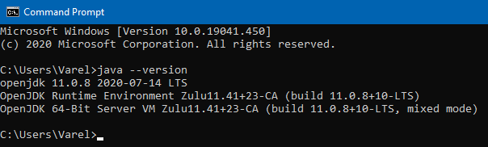
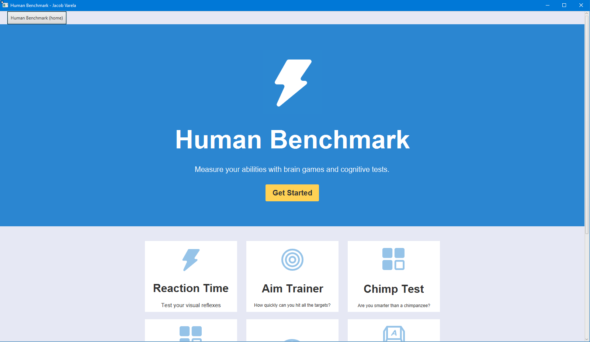
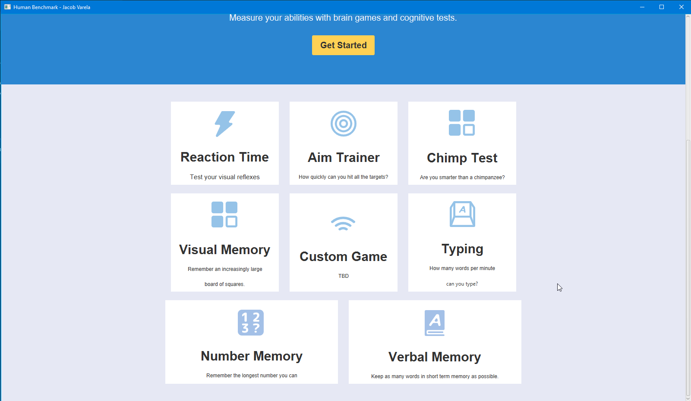
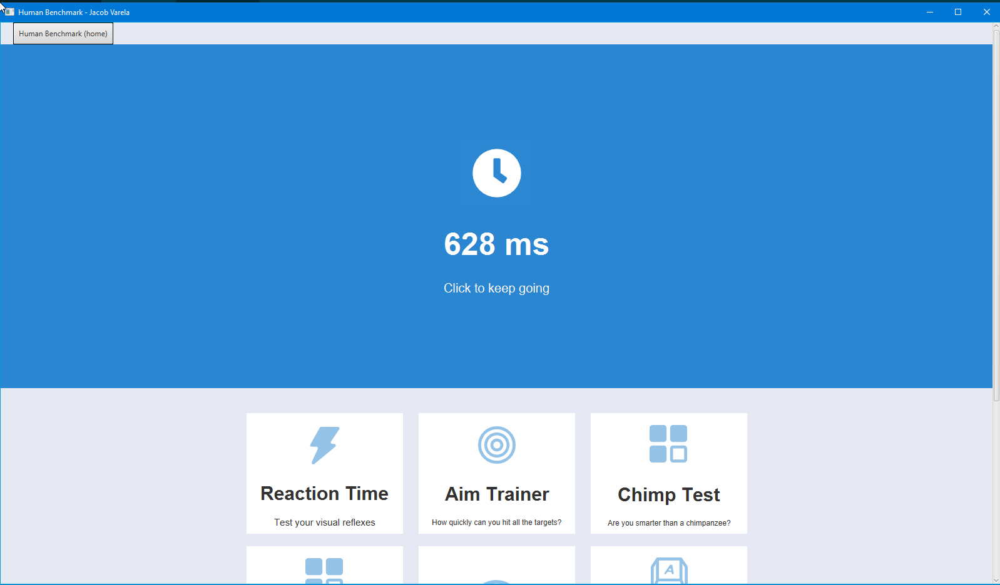

<!-- PROJECT LOGO -->

# Human Benchmark Project

<!-- TABLE OF CONTENTS -->
## Table of Contents

* [About the Project](#about-the-project)
  * [Built With](#built-with)
  * [Document Structure](#document-structure)
  * [Project Requirements](#project-requirements)
  * [Design Choices](#design-choices)
* [How to run this program](#how-to-run-this-program)
* [Usage](#usage)
* [Contact Info](#contact-info)

<!-- ABOUT THE PROJECT -->
## About The Project

<!--[![Product Name Screen Shot][product-screenshot]] -->

*  This project is a recreation of some minigames from the following site:
    * https://humanbenchmark.com/
* This project contains various minigames that have been implemented using Java/JavaFX.

### Built With
* [Java 11 (LTS)](https://www.azul.com/downloads/zulu-community/)
 

### Document Structure:
Document                 | Description
--------------------     | --------------------
README.md                | Text file that contains information about the project.
.gitignore               | Contains the filetypes that will be excluded from the project repository.
 src/                    | Contains all the class files.
 docs/                   | Document directory that contains the design documents.
 resources/              | Contains images for the README  
 HumanBenchmark.jar      | .jar file containing the program.

### Project Requirements
#### Minigames:
- [x] Reaction Time: tests your reaction time by seeing how quickly you can click a button after the screen changes color.
- [ ] Aim Trainer: times how long it takes you to click 30 targests that randomly appear on the screen.
- [ ] Chimp Test: click the boxes in numerically increasing order. After you click the first box the numbers dissapear. 
- [ ] Visual Memory: a grid of squares is shown where some of the squares are white and some are not. Then the white squares become the same color as the other squares. The user must click only the squares which were white.
- [ ]  Typing: times how long it takes the user to type out a given paragraph with no mistakes allowed.
- [x] Number Memory: users must recall an ever increasing number of digits.
- [x] Verbal Memory: users must mark a word as "seen" or "new", 3 strikes and your out. 
- [ ] Custom Minigame: TBD...

### Design Choices

* To create the games I started off by creating my main screen with a GridPane within a ScrollPane. This allowed me to easily recreate the look and feel of the website in JavaFX.
  * I was able to easily add a home button in the Gridpane.Top section.
  * I used the Gridpane.Bottom section to display the other game options, which was achieved using a combination of Hboxes and Vboxes.
  * I used the Gridpane.Center section to display the home screen, as well as to change depending on what game is being played.
* Created a list of 100 words for the Verbal Memory test using the following website:
  * https://capitalizemytitle.com/random-word-generator/

<!-- HOW TO RUN -->
## How to run this program
  1. Download the .jar file.
  2. Open a new terminal/command window.
  3. Navigate to the directory where the .jar file is stored.
  4. Type the following into the command line, then hit "Enter".

        `java -jar HumanBenchmark.jar`

  5. Have fun with the games!  

<!-- USAGE EXAMPLES -->
## Usage

* HomeScreen

* HomeScreen scrolled down

* Example of my Reaction Time

<!-- CONTACT INFO -->
## Contact Info

* *VarelaJacob@UNM.edu*
* [LinkedIn](https://www.linkedin.com/in/jacobvarela/)
